<p align="center">
  
</p>

# syntropic137-skills

Harness-agnostic skills for agents **using** a deployed Syntropic137 instance.

Install with the [`skills`](https://www.npmjs.com/package/skills) CLI:

```sh
# list what this repo offers
npx skills add syntropic137/syntropic137-skills -l

# install one skill for Claude Code and Codex
npx skills add syntropic137/syntropic137-skills --skill <skill-name> -a claude-code -a codex -y

# or every skill
npx skills add syntropic137/syntropic137-skills --skill '*' -a claude-code -a codex -y
```

The skill is selected with `--skill`; an `owner/repo/<skill-name>` path does not
work ("No skills found"). Add `-g` to install for your user instead of the current
project. `-a` accepts `claude-code`, `codex`, `gemini-cli` and ~70 others, and the
same skill body serves every one of them. Verified with `skills` 1.7.0:
`claude-code` lands in `.claude/skills/`, `codex` in `.agents/skills/`.

Pin a release to make the install reproducible and upgrade on purpose:
`npx skills add syntropic137/syntropic137-skills#v1.1.0 --skill <skill-name> ...`.
Without `#<tag>` you track `main`, and `skills update` brings whatever changed.
Releases and per-skill versions are listed in [CHANGELOG.md](CHANGELOG.md);
each skill states its own in `metadata.version`.

Syntropic137 workspaces use the same CLI, pointed at a local copy of the skill
(`skills add <path-to-skill> --agent <agent> -y`).

## What belongs here, and what does not

This repo is for agents operating a **deployed system**. Its skills may use only
the product surface: the HTTP API, the `syn` CLI, and the session store. They may
not reference repository paths, `file:line` citations, ADR numbers, or internal
module names, because a consumer does not have the repository.

That gives the boundary a check anyone can apply in review:

> **If a skill cites a `file:line`, it is in the wrong repo.**

Skills for agents working **on** Syntropic137 - contributing code, debugging the
platform, running experiments against its own workflows - live in the
`syntropic137/syntropic137` repository instead, where internal citations are
exactly what makes them useful.

## Skills only

No slash commands, no hooks, no agent definitions. Those are harness-specific by
construction: Codex has no slash commands, no `SessionStart` hook, and no
subagent definition format. A repo that mixes them cannot honestly claim to be
agent-agnostic, so this one holds a single artifact type.

## Layout

```
skills/<name>/SKILL.md      the skill
skills/<name>/references/   optional depth, loaded only when the body points to it
```

## Contents

| skill | use it when |
|---|---|
| [`mining-session-logs`](skills/mining-session-logs/SKILL.md) | You have a pile of finished agent runs and want to know what they teach - recurring failures, wasted effort, cost concentration - written down so the lesson outlives the runs. |
| [`syn-workflow`](skills/syn-workflow/SKILL.md) | You need to find a workflow, read what inputs it takes, start it with the right task and repositories, or register, update or archive it. |
| [`execution-control`](skills/execution-control/SKILL.md) | A run has started and you need to follow it, cancel it, resume it, or find out why it failed before deciding what to do next. |
| [`observing-sessions`](skills/observing-sessions/SKILL.md) | You need to know what an agent session did, why it failed, or why a run cost what it did, broken down by phase, model, tool and cache. |
| [`discovering-run-sessions`](skills/discovering-run-sessions/SKILL.md) | You need every session of one run, including delegates and native transcripts, with whether the list is known to be complete. |
| [`github-triggers`](skills/github-triggers/SKILL.md) | You want a workflow to run on GitHub events, or need to know why a trigger did or did not fire. |
